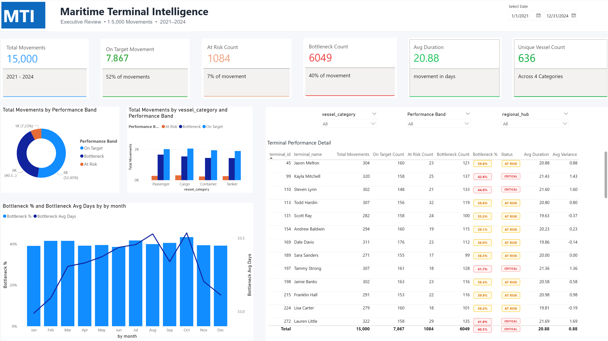
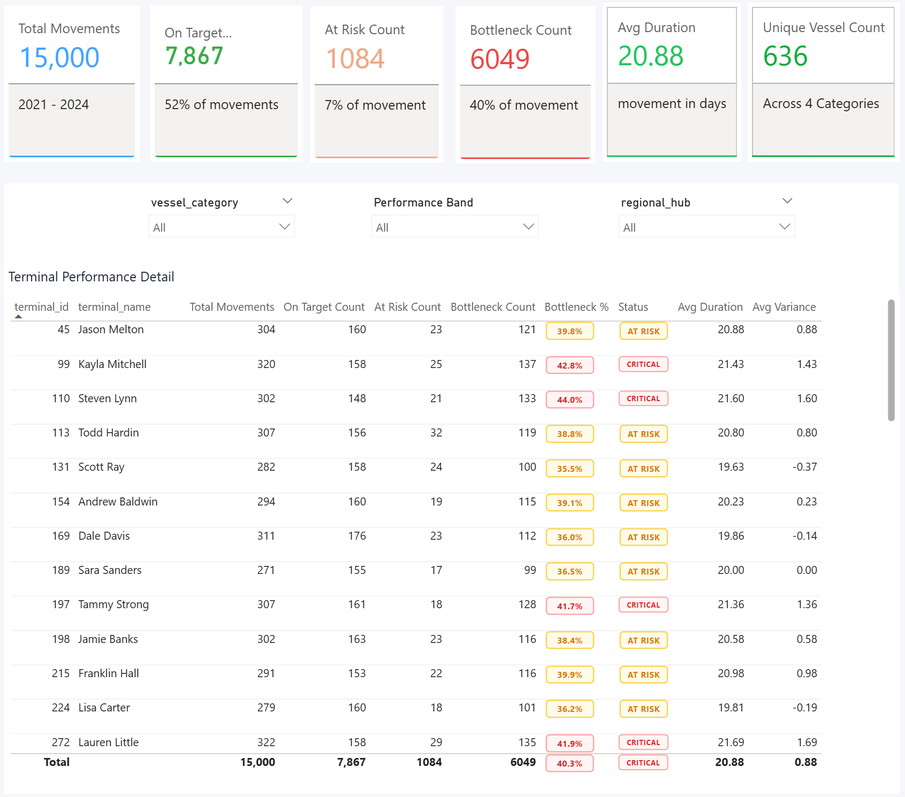

# Maritime Logistics Analytics Dashboard

A Power BI project analyzing maritime terminal performance, cargo movement efficiency, and operational bottlenecks.

---

## Project Overview

This project analyzes maritime terminal operations to evaluate cargo movement efficiency, identify bottlenecks, and support data-driven decision-making in logistics environments.
The dataset includes ~15,000 cargo movements across multiple terminals and vessel categories from 2021 to 2024.

---

## Highlights

- Built an end-to-end Power BI dashboard using a star schema data model  
- Developed DAX measures for KPI tracking and performance classification  
- Designed an executive-level dashboard for logistics performance monitoring  
- Implemented interactive filtering for multi-dimensional analysis  

---

## Data Model

The dashboard is built using a star schema:

- fact_cargo_movements  
- dim_terminal  
- dim_vessel  
- dim_time  

---

## Tools & Technologies

- Power BI  
- DAX  
- Data Modeling  

---

## Dashboard Preview



---

## Key Insights

- Bottleneck movements represent a significant portion of operations  
- Performance varies across terminals and vessel categories  
- Data highlights areas for process improvement and optimization  

---

### KPI & Terminal Performance View



## Project Structure

```
maritime-logistics-analytics-dashboard/
│
├── data/
│   ├── dim_terminal.csv
│   ├── dim_time.csv
│   ├── dim_vessel.csv
│   └── fact_cargo_movements.csv
│
├── dashboard/
│   └── maritime-terminal-intelligence-dashboard.pbix
│
├── images/
│   ├── dashboard-preview.png
│   └── kpi-performance-analysis.png
│
├── docs/
│   ├── project-report.md
│   ├── DATA_DICTIONARY.md
│   └── business-context.md
│
└── README.md
```

---

## Example DAX Calculations

```DAX
At Risk Count = 
CALCULATE(
    COUNTROWS(fact_cargo_movements),
    fact_cargo_movements[Performance Band] = "At Risk"
)

Bottleneck % = 
DIVIDE([Bottleneck Count], [Total Movements])
```

---

## Business Impact

- Enables identification of inefficient ports and operational bottlenecks  
- Supports data-driven decision-making in logistics planning  
- Helps reduce delays and improve supply chain efficiency  

---

## Getting Started

1. Download the `.pbix` file  
2. Open it in Power BI Desktop  
3. Use filters and visuals to explore insights  

---

## Author

Md Abrar Fahim  
B.Sc. Information Engineering – HAW Hamburg 
